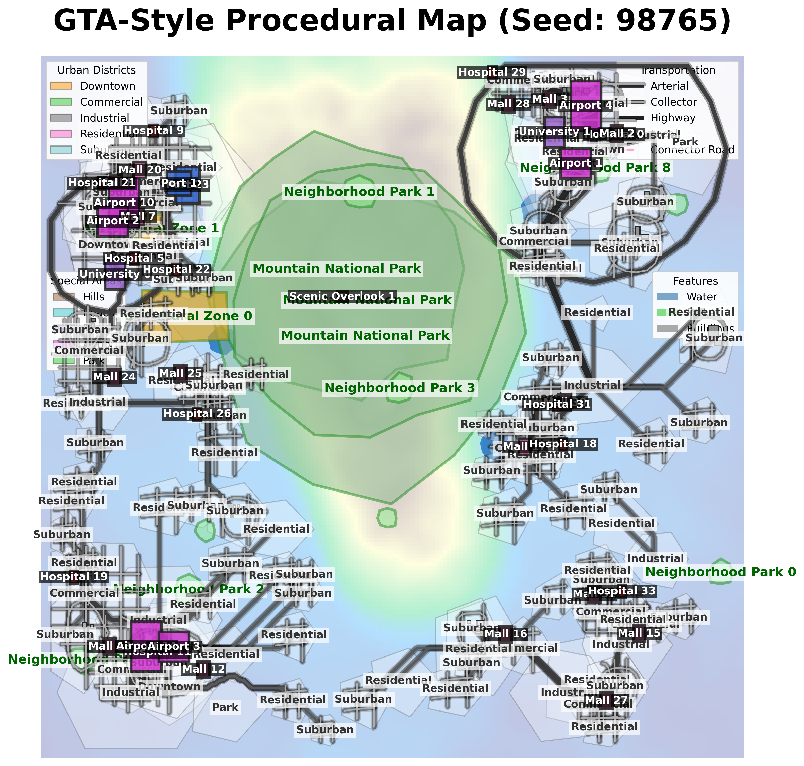

# GTA Map Generator

Ever wanted to design a city like a GTA boss? Now you can! This Python tool whips up wild, sprawling city maps—just add imagination (and maybe a little chaos).

## 🚦 Quick Start

```bash
pip install -r requirements.txt
python main.py
```
Then open [http://localhost:5001](http://localhost:5001) and watch the magic happen.

## 🤖 What Does It Do?
- Generates random, detailed city maps (think: roads, districts, buildings, and more)
- Outputs pretty PNGs and juicy JSON data
- Works in your browser or from the command line

## 🎉 Demo Output

Here’s what you get (actual output may contain more mayhem):

**Map Preview:**


**Sample JSON:**
```json
{
  "width": 2000,
  "height": 2000,
  "generation_seed": 4484,
  "districts": { ... },
  "transportation": { ... },
  "buildings": { ... }
  // ...and a whole lot more!
}
```

## 🕹️ Pro Tips
- Try different presets for new city vibes
- Tweak the config if you’re feeling fancy
- Output files land in the `static/` folder

## 🦸‍♂️ Contributing
PRs welcome! Add your own city flavor, or just fix my typos.

---
Built with Python, Flask, and a love for city chaos. Not affiliated with Rockstar Games (but we wish!).
